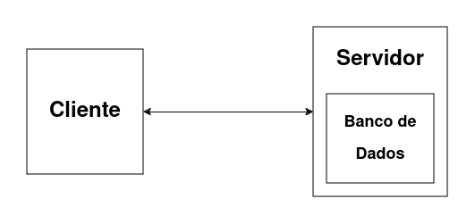
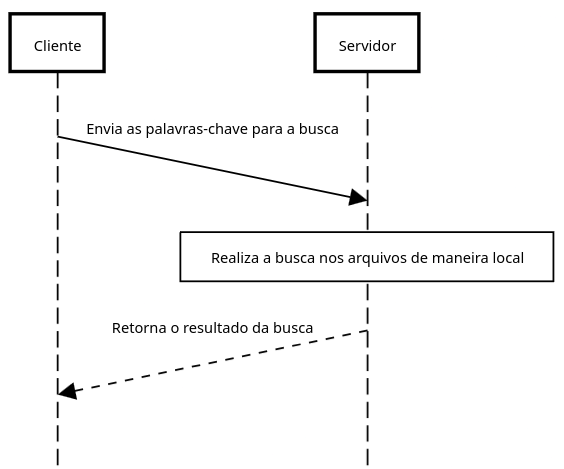

# Atividade Prática da Disciplina de Sistemas Distribuídos
## Projeto MyGoogle

Esta versão inicial do projeto implementa somente a funcionalidade de busca por palavras-chave em um único arquivo.

A arquitetura atual consiste em um cliente que realiza as requisições de busca, e um servidor que atende essas requisições e realiza a busca nos seus arquivos que estão salvos localmente.

Abaixo estão diagramas que ilustram a arquitetura atual.

