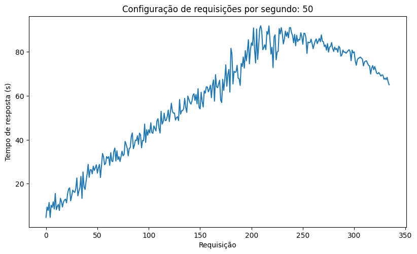
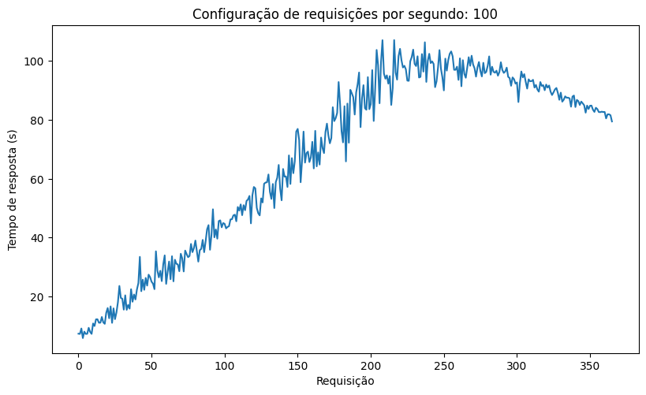
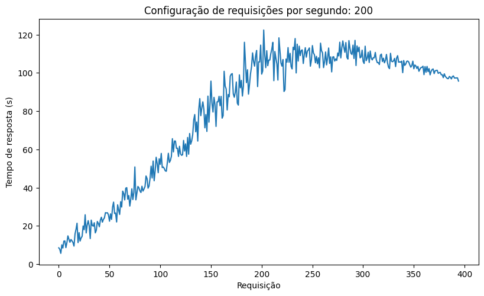
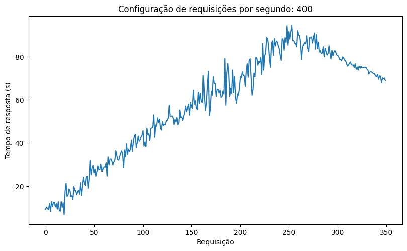

# Resultados dos Testes
Foram realizados testes com as configurações para gerar 50, 100, 200 e 400 requisições por segundo durante 1 minuto. Porém, devido à arquitetura dessa versão atual e à realização dos testes sendo limitada a uma única máquina local, o sistema rapidamente chega a um limite de requisições realizadas. Por essa razão, em todos os casos o sistema atinge um limite próximo de 350 requisições realizadas ao longo de 1 minuto.

## Teste: 50 requisições por segundo
Média: 58.16

Mediana: 64.14

Desvio Padrão: 24.74

## Teste: 100 requisições por segundo
Média: 67.22

Mediana: 80.55

Desvio Padrão: 30.02

## Teste: 200 requisições por segundo
Média: 79.47

Mediana: 98.15

Desvio Padrão: 34.21

## Teste: 400 requisições por segundo
Média: 57.48

Mediana: 62.66

Desvio Padrão: 24.18

